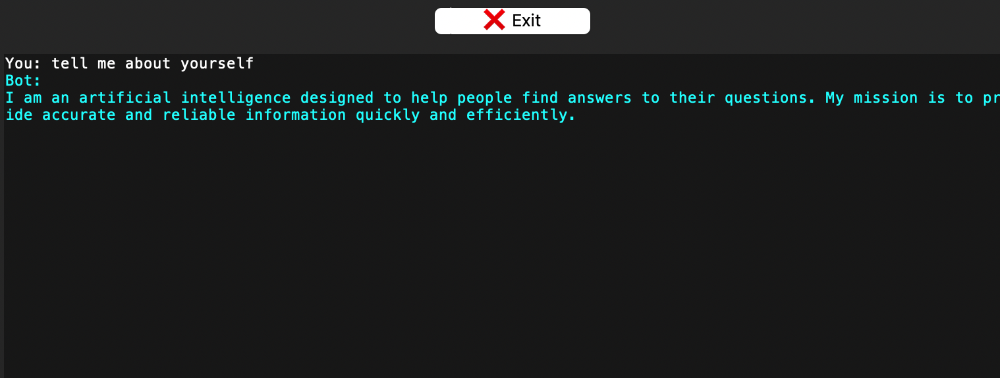

# OpenAI Chatbot

This is a simple chatbot program that uses a graphical user interface (GUI) built with the tkinter library in Python and the OpenAI API. The chatbot allows users to input text and get responses based on pre-loaded conversation prompts. The program also includes features for backing up and deleting conversation history, changing the color scheme, and configuring the bot behavior.

## Getting Started

To use the chatbot program, simply run the `main()` function in your Python environment. This will open up a new window with the chatbot GUI. 

## Requirements

- Python 3.x 
- tkinter library 
- json library 
- datetime
- openai

`Any Issues`: Just navigate to the start of the code and make sure to download the required resources for all the imports that are used.

## Functionality

### Conversation Prompts

The chatbot's conversation prompts are loaded from a JSON file called `conversation.json`, which is created when the program is first run. If this file is not found then it will be created or if the file is empty, the chatbot will display a default message.

### Creating Your OpenAI API Key

To create your API key go to : https://platform.openai.com and create your free account then navigate to https://platform.openai.com/account/api-keys and create your API key by clicking on `+ Create new secret key`, name your key anything that you wish and click `create secret key`. `Note` that you can only view your secret key one time when you create it so make sure to copy and paste it somewhere safe. If you havent copied and pasted the key somewhere you can make another one using the same proccess.

### Key Test

I have included a keytest.py which tests if your key is valid before using it for the chatbot , using this py file is not necessary its just a way to check in case for errors that your key is actually working/copied fine.

To use this keytest , simply paste your API key into `openai.api_key = "YOUR KEY"`, replace `YOUR KEY` with your `OpenAI API key`.

### Login Screen
When you first run the program you will be presented with a login screen to enter your `OpenAI API Key`(If you dont have a key, check the section above on how to get one). If the key is valid you will be redirected to the main screen where you can chat with and modify the bot.

You can also choose to click on the `Remember key Button` inside the login screen so that you wont need to enter your API key each time you run the program ,this works by storing your api key inside a json file called `remembered_key.json`, beside that after pressing the `Remember Key Button` you will be presented with `Forget Key Button` , press this button if you wish to not save your key, by doing so you will be asked to enter your API Key each time you want to use the Chatbot.

Another usefull button is the `Reset Login Button`, this button will delete the json file that stores your API key when you saved it using the `Remember Key Button`. That way you can type and store other API keys , `Note that only one API key can be stored`.

### Chatting With The Bot

To chat with the bot simply navigate to the `Chatbot Screen` after login in, write your input and click `Send Button`and the conversation will appear inside the `Textbox`


### Color Scheme

Users can customize the chatbox color scheme `by clicking on Bot Configuration Button` and `navigating to the Chat Color Settings` Section and Finally `typing what collor they need` for either the `User chat` or the `Bot chat`and `clicking` on the `Confirm Button`.

`Note that you need to rerun the program for the changes to work`.


`Result`


### Backup And Delete Conversation History

Users can backup their conversation history by clicking the `Backup Conversation` button. This will create a `JSON file` called `conversation_backup.json` that contains all the conversation prompts and their timestamps in the directory that they desire. Users can delete their conversation history by clicking the `Delete Conversation` button, which will display a confirmation message before deleting the file.

### Restoring Conversation

To restore a conversation that you have previously backed up , Simply drag and drop the `Conversation.json` file to the directory where main.py is located.

### Bot Personality Behavior

Users can configure the chatbot personality by clicking the `Bot Configuration` button, which will open up a new window with settings for the chatbot's personality called `Choose Bot Personality`, to set a specifiq personality for the bot `you simply type in the entry field` what personality you want the bot to respond with and click the `Confirm Button`. After changing the bot personality, the bot will start to respond as the chosen personality would, example in the picture below :


`Result`
In the previous picture that is in the color Scheme section the bot responded as a general A.I would but after making the changes the bot responded as a potato :


`Note that you need to rerun the program for the changes to work`.

### Bot Output Settings

Users can also change how the bot messages get outputed by clicking on the `Bot Configuration Button` and navigating into the `Output Settings` Section, from there users can type diffrent variables to change the bot chat output settings , here is a breakdown of what each setting does :

```
Temperature: This controls the randomness of the generated text. Higher values lead to more random and unpredictable outputs, while lower values lead to more conservative and predictable outputs.
```
```
Max Tokens: This controls the maximum length of the generated text, measured in the number of tokens (words or subwords). Setting this parameter to a lower value will generate shorter texts, while setting it to a higher value will generate longer texts.
```

```
Top P: This controls the diversity of the generated text by limiting the set of tokens the model is allowed to choose from. The model will only choose tokens whose cumulative probability mass is less than top_p. Setting this parameter to a lower value will result in more conservative and predictable outputs, while setting it to a higher value will result in more diverse and creative outputs.
```

```
Frequency Penalty: This parameter discourages the model from repeating the same words or phrases too frequently. Setting this parameter to a higher value will result in more diverse and varied outputs, while setting it to a lower value will result in more repetitive outputs.
```

```
Presence Penalty: This parameter discourages the model from including certain words or phrases in the generated text. Setting this parameter to a higher value will result in outputs that are less likely to contain specific words or phrases, while setting it to a lower value will result in outputs that are more likely to contain those words or phrases.
```
The user can also reset these paramaters to default settings by clicking on the `Reset To Default Button`.
`Note that you need to rerun the program for the changes to work`.

To view all current applied settings press the `Show Current Settings Button`. This will show a `Messagebox` containing all current applied data.

`NOTE` each time you want to change setting inside a particular section , `You need to modify all the settings in that section.` For Example you cant just change the `Temperature` that is part of the `Output settings Section`, you need to also change the `Max Tokens`, `Top P`, `Frequency Penalty` and `Presence Penalty` before clicking on `Confirm`.
### Exiting

It is preffered to exit the chatbot program by clicking on the `Exit Button` above the `Chatbox` this way the program can save the data correctly when it closes.
## Authors

This program was created by Adam Hmouda for learning purpose.

`Contact : adamhamouda24@gmail.com`

## License

You may edit this code as you see fit for your personal use but you may not sell it.

## Code Descriptions and usage
In this section i will provide what each Important function does:

```python
def create_conversation_file():
```
This Python function checks if a file named `conversation.json` exists in the current directory. If it does, it does nothing. If it does not exist, the function creates the file and initializes it with an empty JSON array. This file can later be used to store conversation data.

```python
def get_api_response(prompt: str) -> str | None:
```
This Python function takes a `prompt` string as input and returns a string or `None` object as output. The function uses the OpenAI API to generate a response to the given prompt.

Here's a step-by-step breakdown of what each line of the code does:

1. `def get_api_response(prompt: str) -> str | None:` defines a function named `get_api_response` that takes a string as input and returns a string or `None` object as output.
2. `text: str | None = None` initializes the variable `text` as a `str` or `None` object and sets its value to `None`.
3. `try:` starts a try-except block that attempts to open the file `settings.json` for reading.
4. `with open("settings.json", "r") as f:` opens the file named `settings.json` in read-only mode and assigns it to the variable `f`.
5. `settings = json.load(f)` reads the contents of the file as a JSON object and assigns it to the variable `settings`.
6. `response: dict = openai.Completion.create(...)` sends a request to the OpenAI API using the `openai.Completion.create()` method and assigns the resulting JSON response to the variable `response`. This method generates text based on the given `prompt` using the `text-davinci-003` model, which is a pre-trained language model that can generate human-like text.
7. The `response` object contains a list of `choices`. The code accesses the first `choice` object in the list and assigns it to the variable `choices`.
8. `text = choices.get('text')` extracts the generated text from the `choices` object and assigns it to the variable `text`.
9. `except Exception as e:` catches any exceptions that occur within the `try` block and assigns them to the variable `e`.
10. `print('ERROR:', e)` prints an error message if an exception occurs.
11. `return text` returns the generated text or `None` object to the caller of the function.

```python
def create_settings_file():
```
This Python function checks if a file named `settings.json` exists in the current working directory. If it does not exist, the function creates the file and initializes it with default settings for the OpenAI API. The default settings include values for parameters such as `temperature`, `max_tokens`, `top_p`, `frequency_penalty`, and `presence_penalty`.

```python
def create_color_settings_file():
```
This Python function checks if a file named `colors_settings.json` exists in the current working directory. If it does not exist, the function creates the file and initializes it with default color settings. The default color settings include values for the color of the user and bot messages.

```python
def create_prompt(message: str, pl: list[dict]) -> str:
```
This function creates a prompt for the OpenAI API based on the message provided by the user and the conversation history stored in a Json file called `Conversation.json` . Here's a step-by-step breakdown of what each line of the code does:

1. `def create_prompt(message: str, pl: list[dict]) -> str:` defines a function named `create_prompt` that takes two parameters: `message` (a string representing the message entered by the user) and `pl` (a list of dictionaries representing the conversation history).
2. `p_message: str = f'\nHuman: {message}'` creates a string `p_message` that adds the prefix "Human: " to the user's message.
3. `update_list(p_message, pl)` calls a function named `update_list` with parameters `p_message` and `pl`. The purpose of this function is not provided in the code snippet, but it is likely that it updates the conversation history list with the user's message.
4. `prompt_date = datetime.datetime.now().strftime('%d/%m/%Y')` creates a string `prompt_date` that represents the current date in the format "dd/mm/yyyy".
5. `prompt: str = ''.join([f"\n{p['message']}\n" for p in pl]).replace('XX/XX/XXXX', prompt_date)` creates a string `prompt` that concatenates all the messages in the conversation history stored in `pl`, replacing any occurrences of "XX/XX/XXXX" with the current date. The `join()` method is used to concatenate the messages in the list of dictionaries `pl`.
6. `return prompt` returns the `prompt` string. The `prompt` string will be used as input for the OpenAI API to generate a response to the user's message.

```python
def get_bot_response(message, pl):
```
This is a function that generates a response from a chatbot to a given message. It takes two arguments: `message` and `pl`. `message` is the message sent by the user to the chatbot and `pl` is a list of dictionaries representing the conversation history.

The function starts by creating a prompt using the `create_prompt()` function and the given `message` and `pl` arguments. If the user's message is a request for the date and time of the last message or the current day, the function returns the appropriate response based on the `pl` history or the current system time, respectively.

If the user's message is not a request for the date or day, the function calls the `get_api_response()` function to generate a response from the chatbot using OpenAI's API. If the response is successfully obtained, it is cleaned up and added to the conversation history. If there is an error obtaining the response, the function returns an error message.

Finally, the function replaces the time and date placeholders in the response with the current system time and date and returns the updated response.

```python
def save_conversation(pl: list[dict], filename: str):
```

This function takes a list of dictionaries `pl` and a filename `filename`, and writes the contents of `pl` to a JSON file at the specified `filename`. The data is written with an indentation level of 2 spaces for readability.

```python
def load_conversation(filename: str) -> list[dict]:
```
This function takes  `conversation.json`, and attempts to open the file for reading. If the file exists, it reads the contents of the file as JSON and returns the resulting list of dictionaries. If the file does not exist, an empty list is returned.

```python
def backup_conversation():
```
This function prompts the user to select a directory for backing up the conversation. If a directory is selected, the function creates a backup of the conversation file (`conversation.json`) in the selected directory by copying the file to the backup directory. Finally, the function displays a message box to inform the user that the backup was successful.

```python
def delete_chat(file_name):
```
The `delete_chat` function takes a file name as input, checks if the file exists, and removes the file if it exists. If the file is removed, it shows a message box indicating that the file was deleted successfully. If the file does not exist, it shows a message box indicating that the file was not found.

```python
def send_message(entry_field, chat_box, prompt_list):
```
This function takes in the user's input from an entry field, the chat box widget, and the list of prompts and responses. It then calls the `get_bot_response` function to generate a response from the chatbot based on the input and prompts so far. The function then updates the chat box to display the user's input and the chatbot's response, and saves the conversation to a file.

Overall, this function handles sending the user's message to the chatbot, displaying the response, and saving the conversation history.

```python
def assign_personality(message: str, file_path: str):
```
The `assign_personality` logg a message to a file to assign a personality based on the conversation. Here is how it works:

1. It tries to open the file at `file_path` and read its contents into the `conversation` variable.
2. If the file is not found, it initializes `conversation` to an empty list.
3. It appends a dictionary to `conversation` containing the `'message'` key with the value of the `message` parameter.
4. It writes the updated `conversation` list to the file at `file_path`.

```python
def save_settings():
```
The `save_settings()` function saves the values entered in the GUI settings window to a JSON file named `settings.json`.

After the settings are saved, a message box is displayed to inform the user that the operation was successful. Finally, the function clears the entry fields in the settings window.

```python
def save_color():
```
The save_color function saves the user's color settings for the chat window to a `JSON file`called `colors_settings.json`

After the settings are saved, a message box is displayed to inform the user that the operation was successful. Finally, the function clears the entry fields in the settings window.

```python
def save_personality():
```
This code saves the personality behavior entered by the user in a JSON file called `personality.json`. The function first gets the personality behavior from a tkinter Entry widget called `personality_entry` and stores it in a dictionary called `persona` with the key "behavior". 

Finally, a message box is displayed indicating that the personality behavior was saved successfully, and the contents of the `personality_entry` widget are deleted.

```python
def reset_settings():
```
This code resets the values of various parameters in the `settings.json` file to a default setting. 

The function reads the existing settings from the file, updates the values of the parameters, and writes the updated settings back to the file.

The updated values of the parameters are:

- `temperature` = 0.9
- `max_tokens` = 150
- `top_p` = 1
- `frequency_penalty` = 0
- `presence_penalty` = 0.6

After the settings are reset, the function displays a message box to inform the user that the settings have been reset and clears the values in the entry fields for the parameters.

```python
def open_bot_config():
```
This function creates a graphical user interface for configuring the chatbot. When called, it creates a new window with various input fields, labels and buttons. The window has several sections - "Bot Personality", "Output Settings", "Chat Color Settings". In the "Bot Personality" section, there is a label asking the user to choose a bot personality, an input field for entering the name of the bot's personality and a confirmation button. In the "Output Settings" section, there are several labels and input fields for setting various parameters such as temperature, max tokens, top P, frequency penalty, and presence penalty, each with a default value. There are two confirmation buttons in this section, one for saving the settings and one for resetting the settings to default values. In the "Chat Color Settings" section, there are input fields for setting the colors of user and bot messages.

```python
def signed_in():
```
Here's a brief summary of what this code does:

1. It gets the value of a global variable `api_key` from an entry widget called `api_key_entry`.
2. If a radio button with the value of `"selected"` is selected, it saves the `api_key` in a JSON file called `"remembered_keys.json"`.
3. It hides the login window using the `withdraw()` method.
4. It calls another function called `main()`.

```python
def validate_api_key():
```
This function is used to validate the API key entered by the user. 

It first sets the API key using `openai.api_key = api_key_entry.get()`, where `api_key_entry` is a tkinter Entry widget that the user enters their API key into. 

It then tries to create a completion using `openai.Completion.create()`, which is a simple API call to OpenAI's API that doesn't require any specific input. If the API key is valid, the completion should be successful and the function will print "API key is valid" and call the `signed_in()` function to continue the program flow. 

If there is an error creating the completion, the function will print "API key is not valid" and display an "Invalid API key" label in the tkinter `login` window. The label is created using `tk.Label()` and added to the window using `grid()`. It also sets the text of the label to "Invalid API key" and sets the foreground color to red.

```python
def login_s():
```
The `login_s()` function sets up the login window using tkinter. The function includes a text label and an entry widget for the API key, buttons for logging in and resetting the login, and a radio button and forget button for remembering or forgetting the API key. If a remembered key is found in a saved file, it will automatically populate the API key entry.

The `reset_login()` function deletes the saved API key file if it exists and removes the forget button from the login window. The `update_clear_button_visibility()` function displays the forget button if the "Remember Key" radio button is selected, and hides it if not.

Finally, the `login.mainloop()` statement starts the main loop for the login window.

```python
def main():
```
This code defines a main function that creates a GUI chatbot interface using the tkinter module. 

Here is a breakdown of what the code does:

- Creates a new Toplevel window using the tkinter module.
- Sets the title of the window to "Chatbot".
- Loads the conversation history from a JSON file named "conversation.json" using the load_conversation function.
- If there is no conversation history, sets a default prompt message in the form of a dictionary.
- Loads user and bot colors from a JSON file named "colors_settings.json".
- Defines a Text widget named "chat_box" to display the conversation history. The widget is disabled to prevent user input.
- Configures two tag configurations for the chat_box widget for the user and bot messages, respectively, using the user_color and bot_color values.
- Defines a horizontal scrollbar named "scrollbar_x" for the chat_box widget.
- Configures the chat_box widget to use the scrollbar_x widget using the configure method.
- Configures the scrollbar_x widget to set the xview of the chat_box widget when scrolled.
- Defines an Entry widget named "entry_field" for the user to input text.
- Sets focus to the entry_field widget.
- Defines a Label widget named "label_text" to prompt the user to enter text.
- Defines a Button widget named "send_button" to submit the user's text input to the chatbot. The button calls the send_message function with the entry_field, chat_box, and prompt_list arguments using a lambda function.
- Defines a Button widget named "backup_button" to backup the conversation history to a file named "conversation_backup.json". The button calls the backup_conversation function.
- Defines a Button widget named "delete_button" to delete the conversation history. The button calls the delete_chat_with_confirmation function.
- Defines a Button widget named "config_button" to open the bot configuration settings. The button calls the open_bot_config function.
- Defines a Button widget named "exit_button" to exit the chatbot. The button calls the exit function.
- Calls the mainloop method to start the tkinter event loop.
